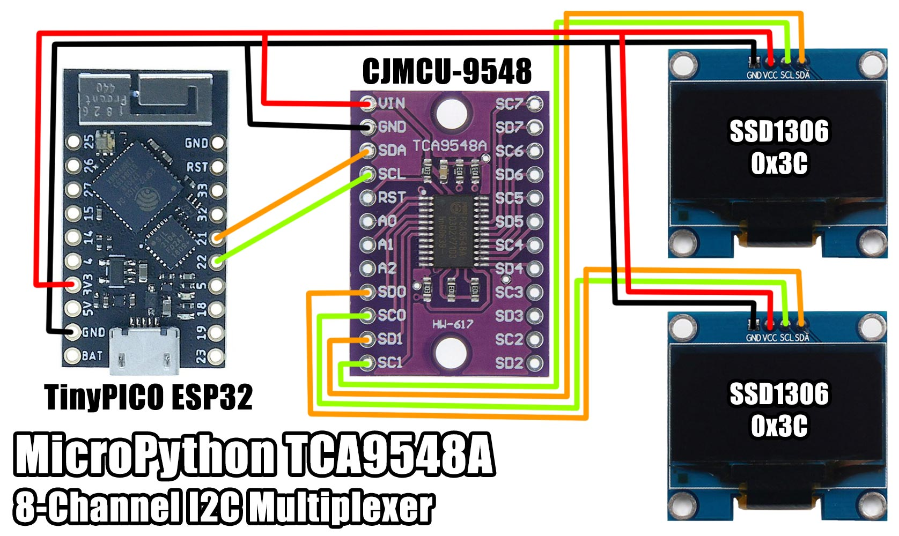

# MicroPython TCA9548A 8-Channel I2C Multiplexer

A MicroPython library for the CJMCU-9548 module, featuring the TCA9548A.
This module lets you run multiple I2C devices with the same address on the bus,
by spreading the conflicting devices across 8 channels and toggling between them.

The module itself is present on the I2C bus with a configurable address of 0x70-0x77 using the A0,A1,A2 pins.
This lets you daisy chain them and have up to 64 devices on the bus with the same address.

It features a single 8-bit register, where each bit enables each of the 8 channels.
I2C channel 0 is enabled with the LSB and channel 7 with the MSB.
You can also enable multiple channels at the same time.



## Examples

```python
from machine import I2C, Pin
i2c = I2C(scl=Pin(22), sda=Pin(21))

# disable all 8 channels
i2c.writeto(0x70, b'\x00')
i2c.scan()
# [112] - the TCA9548A

# enable channel 0 (SD0,SC0)
i2c.writeto(0x70, b'\x01')
i2c.scan()
# [60, 112] - Display 1 (SSD1306) & TCA9548A

# enable channel 1 (SD1,SC1)
i2c.writeto(0x70, b'\x02')
i2c.scan()
# [60, 112] - Display 2 (SSD1306) & TCA9548A

# enable channels 0 (SD0,SC0) & 2 (SD2,SC2)
i2c.writeto(0x70, b'\x05')
i2c.scan()
# [60, 68, 112] - Display 1 (SSD1306) & SHT31 sensor & TCA9548A

# read which channels are enabled?
i2c.readfrom(0x70, 1)
# b'\x05' - channels 0 and 2 (0x05 == 0b_0000_0101)

# enable all 8 channels
i2c.writeto(0x70, b'\xff')

# disable all 8 channels
i2c.writeto(0x70, b'\x00')
```


## Two SSD1306 OLED displays

```python
from machine import I2C, Pin
i2c = I2C(scl=Pin(22), sda=Pin(21))
i2c.scan()
# [112]

# enable channel 0 (SD0,SC0)
i2c.writeto(0x70, b'\x01')
i2c.scan()
# [60, 112]

import ssd1306
oled = ssd1306.SSD1306_I2C(128, 64, i2c)

# write to the first display
oled.fill(0)
oled.text('Display 1', 0, 0, 1)
oled.show()

# enable channel 1 (SD1,SC1)
i2c.writeto(0x70, b'\x02')

# init the second display
oled.init_display()

# write to the second display
oled.fill(0)
oled.text('Display 2', 0, 0, 1)
oled.show()

# enable channels 0 (SD0,SC0) & 1 (SD1,SC1)
i2c.writeto(0x70, b'\x03')

# write to the both displays
oled.fill(0)
oled.text('Hello', 0, 0, 1)
oled.show()
```

## I2C Address

There are three address select pins (A0,A1,A2) providing addresses 0x70-0x77 for up to 8 of these devices on the I2C bus.

The CJMCU-9548 module has pull-downs on the 3x address select pins, so you only need to connect them to VCC to change the address.

A0  | A1  | A2  | I2C Address
:---|:----|:----|:-----------
GND | GND | GND | 0x70
3V3 | GND | GND | 0x71
GND | 3V3 | GND | 0x72
3V3 | 3V3 | GND | 0x73
GND | GND | 3V3 | 0x74
3V3 | GND | 3V3 | 0x75
GND | 3V3 | 3V3 | 0x76
3V3 | 3V3 | 3V3 | 0x77

## Parts

* [TinyPICO](https://www.tinypico.com/) $20.00 USD
* [TCA9548A CJMCU-9548](https://www.aliexpress.com/item/4000139869187.html) $1.23 AUD

## Connections

### TinyPICO ESP32

```python
from machine import Pin, I2C
i2c = I2C(scl=Pin(22), sda=Pin(21))
```

TCA9548A | TinyPICO (ESP32)
-------- | ----------------
VIN      | 3V3
GND      | GND
SCL      | 22 (SCL)
SDA      | 21 (SDA)

## Links

* [micropython.org](http://micropython.org)
* [TCA9548A datasheet](docs/tca9548a.pdf)
* [TinyPICO Getting Started](https://www.tinypico.com/gettingstarted)

## License

Licensed under the [MIT License](http://opensource.org/licenses/MIT).

Copyright (c) 2020 Mike Causer
